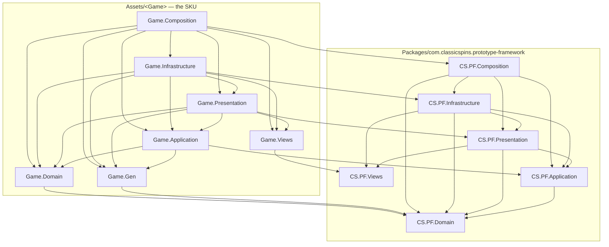

<!-- GENERATED by PrototypeFramework 0.4.2 from Documentation~/agent/architecture-map.md — do not edit here. Change it in the framework repo, then run Framework/Agent Docs/Sync (editor) or Tools/Build/pf-build.sh agentdocs. -->

# PrototypeFramework — architecture map

The **shape** half of the agent pack. The rules are in `AGENTS.framework.md`; the exhaustive type
list is in `framework-api.index.json` (generated); procedures are in `recipes/`.

Read §1 and §2 before writing code that crosses a boundary. Use §10 as the entry point when your
question is "where does this go?".

---

## §1 — Assembly graph (AD-1)

**Fourteen runtime assemblies: six framework, eight SKU.** **Namespace ≡ assembly name, always.**
Dependencies point one way, inward. The compiler is the enforcement.

The SKU's eight mirror the framework's six **name for name** — `Game.Domain` ↔ `CS.PF.Domain`,
`Game.Application` ↔ `CS.PF.Application`, and so on — so nobody translates between the two halves.



| Assembly | Holds | References | Path |
|---|---|---|---|
| **Domain** | Engine-free POCOs: models, rules, key types, event types, `IRandom`, `IUserModel` | **nothing** (`noEngineReferences: true`) | `Runtime/Domain/` |
| **Application** | Ports whose signatures carry **no** engine type; policy POCOs; the boot scheduler | Domain | `Runtime/Application/` |
| **Presentation** | Ports whose signatures **do** carry engine types; controller bases (`ScreenBase`, `DialogBase<T>`) — plain classes, never `MonoBehaviour` | Views, Application, Domain | `Runtime/Presentation/` |
| **Views** | `MonoBehaviour` View bases (`DialogViewBase`, `ToastViewBase`, `WidgetViewBase`), `TextProxy` | only `UnityEngine`, TMP, LitMotion | `Runtime/Views/` |
| **Infrastructure** | Adapters: Addressables, file IO, AudioMixer, SDK wrappers — **and every fake** | Presentation, Views, Application, Domain | `Runtime/Infrastructure/` |
| **Composition** | Per-system installers, `RootLifetimeScope`, `IScopeTracker` impl | Infrastructure, Presentation, Application, Domain | `Runtime/Composition/` |
| **Game.Domain** | The game's rules core: models, generators, pure logic | PF Domain (`noEngineReferences: true`) | `Assets/<Sku>/Domain/` |
| **Game.Application** | The game's ports and policy POCOs — a screen `Param`, an `IReduceMotion`, boot-cap declarations | Game.Domain, Game.Gen, PF Application/Domain (`noEngineReferences: true`) | `Assets/<Sku>/Application/` |
| **Game.Presentation** | Controllers: screens, dialogs, widgets, presenters. Plain classes, **never** `MonoBehaviour`, and **no container type** | Game.Application/Domain/Gen/Views, PF Presentation/Views/Application/Domain | `Assets/<Sku>/Presentation/` |
| **Game.Infrastructure** | The game's adapters: platform probes, SDK wrappers, boot nodes | everything below it + PF Infrastructure | `Assets/<Sku>/Infrastructure/` |
| **Game.Composition** | Installers, scopes, `<Sku>FrameworkSettings` — the one SKU tier allowed to name a container | everything above + PF Composition, VContainer | `Assets/<Sku>/Composition/` |
| **Game.Views** | Only the game's `MonoBehaviour` Views — **can never see a service or a controller** | `CS.PF.Views` | `Assets/<Sku>/Views/` |
| **Game.Gen** | Generated keys — engine-free (`noEngineReferences: true`) | PF Domain | `Assets/<Sku>/Gen/` |
| **Game.Editor** | Editor-only SKU tooling | — (`includePlatforms: ["Editor"]`) | `Assets/<Sku>/Editor/` |

Consequences worth memorizing:

- **`Domain` referencing nothing is the load-bearing decision.** It is what makes the headless
  `dotnet test` ship gate possible, which is what makes gameplay testable in seconds. `Game.Domain`
  and `Game.Application` inherit that property, which is why the SKU gate can **glob** them
  (`Assets/<Sku>/**/Domain/**/*.cs`) instead of hand-listing engine-free files.
- **`Views` exists as a separate leaf assembly** so `Game.Views` can inherit `DialogViewBase`
  *without* seeing Presentation's services. That is the entire reason for the sixth assembly.
- **`Game.Presentation` carries no container reference** — exactly like `CS.PF.Presentation`. A
  controller that needs a scope built asks Composition for a port; it never names `LifetimeScope`,
  `IObjectResolver` or an installer. Re-adding a VContainer edge there is a spine change.
- **`Game.Gen` is engine-free because `AssetKeys.gen.cs` lives elsewhere.** It is the one generated
  file that binds a `UnityEngine` type (`AssetKey<GameObject>`), so it lands in
  `Assets/<Sku>/Presentation/Gen/` — mirroring the framework's own `Runtime/Domain/Gen` vs
  `Runtime/Presentation/Gen` split. Without that, `Game.Application` could not reference generated
  keys at all.
- **A new assembly or reference edge is a spine change** (`AGENTS.framework.md` §6). `AssemblyGraphTests`
  pins the graph by set-equality — both a missing and an extra edge redden CI by name.

---

## §1a — Two axes: the assembly is the spine, the folder is the feature

The eight assemblies are **not** eight top-level folders you file work into. Assembly and folder are
**independent axes**, joined by `.asmref`:

```
Assets/<Sku>/
  Domain/ Application/ Presentation/ Infrastructure/ Composition/   ← the 5 anchors (.asmdef each)
  Views/ Gen/ Editor/                                              ← the other 3 anchors
  Features/
    Gameplay/                    ← the FEATURE axis: no .cs, no .asmref of its own
      Domain/         Game.Domain.asmref
      Application/    Game.Application.asmref
      Presentation/   Game.Presentation.asmref
      Composition/    Game.Composition.asmref
    Main/  Shop/  Boot/          ← each carries only the layers it actually has
```

An `.asmref` is three lines — `{ "reference": "Game.Presentation" }` — and it means *the scripts in
this folder compile into that assembly*. Unity resolves membership by **nearest ancestor**: the first
`.asmdef` **or** `.asmref` found walking up. (The precedent is `com.unity.burst`, whose
`Runtime/Editor/Unity.Burst.ForEditor.asmref` pulls that subfolder back into `Unity.Burst` despite
`Runtime/Unity.Burst.asmdef` sitting above it.)

Why both axes:

- **The assembly axis is the architecture.** A controller cannot call an installer, because they are
  in different assemblies and the edge does not exist. That is a compile error, not a review note.
- **The folder axis is how humans read.** Reviewing Gameplay means opening `Features/Gameplay/` and
  seeing every tier of it. Filing by layer alone would scatter one feature across five top-level
  folders.
- **`Features/<X>/` itself holds no `.cs` and no `.asmref`.** Every script sits under exactly one
  declared layer folder, so membership never depends on `.asmref`-inside-`.asmref` nesting.

**An empty anchor is legitimate.** A SKU with no adapters still declares
`Assets/<Sku>/Infrastructure/` and its `.asmdef`: the assembly costs nothing when empty, and its
presence makes the first adapter a file move rather than a routed spine change.

**You do not hand-create any of this.** `Framework/Setup Wizard` emits the eight `.asmdef`s
(`emit --what spine`), and `Scaffold.Sync` writes the `.asmref` beside the first stub it puts in a
feature's layer folder. `Framework/Doctor` check 15 reports a missing anchor or a dangling `.asmref`.

> **A stray script is silent.** A `.cs` with no ancestor `.asmdef`/`.asmref` compiles into the
> predefined `Assembly-CSharp`, which auto-references everything — so it builds green while sitting
> outside the AD-1 boundary entirely. That is the failure mode Doctor check 15 exists to catch.

---

## §2 — Scope tree and lifetime

A VContainer **scope tree** rooted at `Root`, deepening through `Scene → Gameplay` per branch, is
the **ownership axis** of the whole runtime. Everything stateful — pools, subscriptions, dialogs,
sims — belongs to exactly one scope and dies with it. **Dispose order is mechanical law, not a
per-feature judgement call.**

| Scope | Created by | Holds | Dies when |
|---|---|---|---|
| **Root** | `RootLifetimeScope` (`Runtime/Composition/RootLifetimeScope.cs`) | Every framework service, the boot kernel, `IScopeTracker`, `PoolContext` | App exit |
| **Scene** | `SceneScopeFactory` → `SceneLifetimeScope` (`Runtime/Composition/Scenes/`) | The screen controller, its widgets, its dialogs, its subscriptions | The screen unloads |
| **Gameplay** | `GameplayScopeInstaller` (`Runtime/Composition/Gameplay/`) | The sim, `GameplayTickDriver`, per-match state | The match ends / the gameplay branch closes |

**Ctor injection is the only resolution path.** No service locator, no singleton, no
`FindObjectOfType`. A class's dependencies *are* its constructor signature — visible, testable, and
the compiler tells you when a scope cannot supply them.

**Ticking:** `GameplayTickDriver` is the **sole tick entry** for a gameplay scope. A Model is
advanced by a **fixed dt passed as a parameter** and never reads `Time.*` (rule #15). A pause gate
decides whether the tick runs at all.

---

## §3 — Boot kernel

The kernel schedules `IBootNode`s by **capability**, never by node name. A node declares
`Requires` and `Provides`; the scheduler derives the order. `BootGraph.Validate()` rejects a graph
with a missing or cyclic capability before anything runs.

`IBootNode` surface (`Runtime/Application/Boot/IBootNode.cs`) — pinned, reproduce verbatim:

| Member | Meaning |
|---|---|
| `Id` | Node identity for the report |
| `Requires` / `Provides` | `IReadOnlyList<BootCap>` — the only edges the kernel knows |
| `Required` | `true` ⇒ failure aborts boot (`BootAbortedException`) + error screen; `false` ⇒ logged, boot continues |
| `SoftTimeout` | Elapsed ⇒ `Degraded`; the background task **keeps running** (a late arrival is still usable) |
| `HardTimeout` | Elapsed ⇒ the task is actually cancelled |
| `Predicate` | `false` ⇒ `Skipped` — **still emits `Provides`** |
| `ExclusiveGroup` | Same non-empty group ⇒ the scheduler serializes those nodes |
| `Weight` | Relative cost, never a duration. Only the `Framework/Boot Graph` preview consumes it |
| `RunAsync(ctx, ct)` | The work. Returns `BootNodeResult` |

The framework capability set (`BootCaps`, generated into `Runtime/Domain/Gen/BootCaps.gen.cs`):

`LoggingReady` · `ConfigAvailable` · `UserDataLoaded` · `LocalizationReady` · `AssetReady` ·
`UiReady` · `ConsentResolved` · `ClockSynced` · `RemoteConfigFresh` · `AdsReady` · `IapReady` ·
`AnalyticsReady`

**The kernel never moves your node off-thread** (rule #6) — CPU-heavy work self-hops with
`UniTask.RunOnThreadPool` inside `RunAsync`. **Nothing renders boot progress at runtime**: the boot
cover is SKU-owned.

Recipe: [`recipes/add-boot-node.md`](./recipes/add-boot-node.md).

---

## §4 — Three-tier init law

See `AGENTS.framework.md` §4 for the full statement. The one-line test:

> **Boot node ⟺ must be awaited, OR can fail meaningfully, OR needs external ordering.**
> None of the three ⇒ tier 1 (plain DI) or tier 3 (`IAsyncStartable` in the feature's own child scope).

A `MissionInit` node placed in the kernel is a boundary violation — the kernel is feature-agnostic.

---

## §5 — Render layers

Six framework layers, generated into `Runtime/Domain/Gen/RenderLayers.gen.cs`. The `order` is the
render band **and** the camera depth, and each layer owns one Unity culling layer its camera masks
**exclusively**:

| Layer | Band | `GetHost` returns | Unity culling layer |
|---|---|---|---|
| `UnderGamePlay` | −10 | `UnderGamePlayHost` | `PFUnderGamePlay` |
| `GamePlay` | 0 | `GamePlayHost` | `PFGamePlay` |
| `OverlayGamePlay` | 5 | `OverlayGamePlayHost` | `PFOverlayGamePlay` |
| `Ui` | 10 | `UiHost` → its `SafeArea` child | `PFUi` |
| `Popup` | 20 | `PopupHost` | `PFPopup` |
| `Overlay` | 30 | `OverlayHost` | `PFOverlay` |

> **`GetHost(RenderLayers.Ui)` returns the `SafeArea` child, not the `UiHost` canvas itself.** That
> one indirection is why screen furniture on the `Ui` layer is inset from notches and rounded
> corners **by construction** — a widget parented through `GetHost` needs no per-call inset maths,
> and one parented anywhere else silently loses the inset. Every other layer's host is the canvas
> node itself.

> **`GetHost` throws for a layer the Master-Scene rig never wired — it never returns a silent
> null.** `RootLifetimeScope` omits an unwired binding rather than binding a null, so a framework
> layer whose camera/host fields are empty simply vanishes from the rig, and the `ArgumentException`
> from `RenderLayerRegistry` names the layers that *are* bound. A SafeArea node missing from a SKU's
> rig therefore surfaces as a throw at the first `GetHost(RenderLayers.Ui)` call, not as UI drawn in
> the wrong place. Wire the rig (human zone, rule #12); do not code around the throw.

A SKU adds its own layers via `game.layers.json` into `Game.Gen` over the same `RenderLayerId`
value type. Legal SKU bands are **derived from `framework.layers.json`** — strictly inside the
framework's base/ceiling and never on a framework depth, so today **−9..−1 / 1..4 / 6..9 / 11..19 /
21..29** — with a hard budget of **6**. The framework layers, their depths and their `PF*` culling
layers are read-only.

An entry in **either** manifest carries `id` + `order` plus one optional field: **`physicsRaycast`**
(`"none"` | `"2d"` | `"3d"`, case-sensitive, omitted ⇒ `none`) — the world-space pointer-input
declaration, emitted as `WorldRaycastOf` and honoured on that layer's camera at runtime. Only
`GamePlay` declares it (`"2d"`). See §6.

> **Parenting is not placing.** An instance parented under `GetHost(id)` but never `Stamp`ed keeps
> its prefab's layer *and* its prefab's SortingLayer. Always follow `Instantiate(prefab, GetHost(id))`
> with `Stamp(instance, id)`. **How it fails is rig-dependent**, so do not rely on the symptom: on a
> rig whose `GamePlayCamera` masks its own layer alone the object renders on **no** camera and the
> tell is "instantiated and active but invisible", whereas that camera is *permitted* to also mask
> Unity's built-in `Default`, in which case the object draws normally at the GamePlay band and only
> its ordering against `Stamp`ed siblings is wrong. Settle it for your project by reading the
> `GamePlayCamera` culling mask in the Master scene — and either way, check `gameObject.layer` and
> call `Stamp`. See §6.

**The shipped rig is a URP camera stack** (the sanctioned R-3 shape): `UnderGamePlayCamera` is the single
**Base** camera — lowest depth, owns the colour clear — and the other five are **Overlay** cameras in its
`cameraStack`, ordered by ascending depth. Each host canvas is a child of its own camera. Two consequences:

- **In a stack the stack ORDER is the draw order, not the depth value.** Depths stay the manifest's band
  numbers (and `RenderRigBuildCheck` still pins them), but reordering the stack reorders the screen.
- An all-Base rig (one full pass per camera) is equally legal — the contract is camera-count-agnostic — but
  a *mixture* (some Base, some Overlay missing from the stack) is a defect the build check rejects.

**The three-condition test (rule #7).** A new RenderLayer is justified only if it needs:

1. **absolute ordering** relative to a standard layer, **or**
2. its **own camera configuration**, **or**
3. **bulk culling** toggled on/off as a group.

Cannot answer one of those ⇒ use `sortingOrder` **within an existing layer**. And adding one is a
**spine change** — route it.

> Rendering gotcha: each WorldSpace render-layer host canvas needs its **own `GraphicRaycaster`**.
> The symptom of a missing one is "the UI is not clickable" with `RaycastAll` returning 0 hits.
> `Framework/Doctor` check 4 covers this.

---

## §6 — The ruler: world ⟷ canvas

§5 places content; this section **measures** it. One invariant governs the whole rig:

> **`1 texture px == 1 canvas reference px == 1 world unit`** — so an author and an agent size a
> world object and a UI element with the *same* number, at every aspect ratio.

The chain has three links, and a missing one breaks the invariant silently:

| Link | Written by | What it buys |
|---|---|---|
| sprite import `Pixels Per Unit = 1` | `Assets/<Sku>/Editor/SpriteImportDefaults.cs` — Setup-Wizard-emitted, generate-once, applies on an asset's **first** import only. `Framework/Doctor` check 14 names it if the file goes missing. **Two silent gaps:** it hooks `OnPreprocessTexture`, so a `.psd`/`.psb` (imported by `PSDImporter`, not `TextureImporter`) never reaches it, and its scope is `Assets/<Sku>/`, so art outside that folder is never touched — neither case logs anything | 1 texture px == 1 world unit |
| `Canvas.referencePixelsPerUnit = 1` | `WorldSpaceCanvasScaler.ConfigureCanvas`, **at runtime every `Apply()`** — `Canvas` does not serialize the field, so it reloads at Unity's default 100 every time | 1 texture px == 1 canvas reference px. Left at 100, `SetNativeSize()` on a 100×100 sprite yields a 10000×10000 rect and every 9-slice border inflates 100× |
| host canvas `localScale == 1` | `WorldSpaceCanvasScaler.Apply()` | 1 canvas reference px == 1 world unit |

**The design rect is 1080×1920, centred on the camera, and `screenMatchMode` is `Expand`** — so
neither axis ever falls below the reference. `x ∈ [−540, 540]` and `y ∈ [−960, 960]` are visible on
**every** device; a device off 9:16 gains bleed on one axis and never crops. Design inside the safe
rect and treat the rest as bleed.

Those literals are the **authoring** rect. At runtime the same rect is a value you read:
`IWorldViewport.SafeRect` (Presentation port, Infrastructure `WorldViewport`, registered tier-1 by
`WorldViewportInstaller` off the same scene-provided `RenderRigDescription` the registry uses). It is
computed as `min(visible half-extent, design half-extent)` per axis, centred on the GamePlay camera —
an *intersection*, not a copy of the literals, which is what makes "visible on every device" a fact
rather than an assertion: a host authored off `Expand` narrows the rect to what is genuinely on screen
instead of returning one that is partly off it.

**`Camera.orthographicSize` is scaler-owned, not a constant.** `Apply()` writes
`cam.orthographicSize = logicalResolution.y * 0.5f` *before* it measures the frustum — which is what
makes `localScale` come out exactly 1 in the same pass, at any aspect:

| Viewport | Logical resolution | `orthographicSize` | Visible world units |
|---|---|---|---|
| 1080×1920 — 9:16, the reference | 1080×1920 | **960** | 1080 × 1920 |
| 1080×2400 — 9:20 | 1080×2400 | **1200** | 1080 × 2400 |
| 1536×2048 — 3:4 | 1440×1920 | **960** | **1440** × 1920 |

A rig scene file nevertheless always reads `orthographic size: 960`, because an
`EditorSceneManager.sceneSaving` hook stamps the canonical reference-aspect values
(`WriteCanonicalDesignState`) just before Unity serializes. **That `960` is a save-time artefact, not
a runtime value** — never hardcode it and never derive a size or a screen edge from it. To zoom
gameplay, scale a world content root; the camera belongs to the scaler.

**`IWorldViewport` is the sanctioned reader of that scaler-owned projection.** `IRenderLayerRegistry`
hands out the `Camera` for world↔screen conversion but forbids reading `orthographicSize`; the extent
question it refuses is answered by `HalfHeight` (the same number, ≈960→1200 by aspect) and `HalfWidth`
(540 at 9:16, 720 at 3:4), both measured from the camera's centre through `CanvasFitMath` and
**recomputed on every get** — the value is rewritten every `LateUpdate`, so a cached half-extent is the
hardcoded `960` bug behind one indirection. Every port ships a fake: `StubWorldViewport` answers the
reference aspect for fixtures that merely depend on the port.

**The z budget.** Cameras sit at `z = −1000` with `planeDistance 1000`, so every host canvas plane
lands exactly on `z = 0`. The clip planes — `near 0.3`, `far 2000` — put the usable range at
**`z ∈ [−999.7, +1000]`**: not quite symmetric around the canvas plane, and content outside it is
**clipped**, not merely hidden behind something. Depth is **not** what decides draw order: the rig is
a URP camera stack (§5), so stack order picks the camera and `sortingOrder` picks the band inside a
layer.

**Physics is rescaled onto the same ruler.** `PixelsPerMeter = 100` (`FrameworkSettings`), so every
length-, velocity- and acceleration-bearing project setting is ×100 — gravity is **−981**, not
−9.81; default contact offset `1`, not `0.01`. A constant copied from a metre-scaled tutorial is
100× wrong.

**Two questions decide the parent, in order, and they are asked per object (rule #16).**

1. **What does it anchor to?** A screen edge or the safe area — a HUD counter, a score readout, a
   top bar, a currency pill — ⇒ it belongs to the **layer that owns it** and goes under that layer's
   `GetHost`: `Ui` for screen furniture, `Popup` for anything the dialog stack owns, `Overlay` for
   system overlays. A position in the game's own space ⇒ question 2. *This question chooses the
   layer, and for uGUI content it settles the parent outright.*
2. **How does it draw?** `Renderer` ⇒ `WorldRoot`. `Canvas`/uGUI ⇒ `GetHost(id)`. *This question
   chooses the parent once the layer is fixed.*

**Ask them per object, never once for a whole feature.** "The board draws through
`SpriteRenderer`/`TextMeshPro`, **so** it is parented under `WorldRoot`" is one sentence that
answers for a board *and* for the score above it — and the score's answer is wrong. The board and
the score are two objects and take two answers.

**A screen-anchored `Renderer`** — an edge particle burst, a full-bleed SpriteShape backdrop —
cannot be uGUI, so question 1 does not always end at "a widget". `Stamp` it under the owning
layer's host and accept that a host canvas rides its camera every frame: for something anchored to
the screen that is the point, not the bug. Question 1 picks the layer; only the technology forces
`WorldRoot` over a host.

> **World-space pointer input is a layer declaration, not an authoring step** (brief `§5.7.1b`).
> A layer manifest entry carries an optional `physicsRaycast` — `"none"` | `"2d"` | `"3d"`,
> **case-sensitive**, omitted meaning `none`, an illegal value **failing codegen** by layer name —
> which codegen emits as `RenderLayers.WorldRaycastOf(id)` → `WorldRaycastMode`
> (`GameLayers.WorldRaycastOf` is the SKU half). As the Root container is built, `WorldPointerRaycasterInitializer`
> (Composition, tier-1 entry point) hands the live rig to `WorldPointerRaycasters.EnsureOn`
> (Infrastructure), which `AddComponent`s uGUI's `Physics2DRaycaster`/`PhysicsRaycaster` onto that
> layer's **camera** — get-else-add, before the first scene loads. **Nothing is authored**, so the
> component is absent from every serialized scene and the editor-time rig checks correctly do not
> look for it; it exists in PlayMode. Two properties **are** written on it: `eventMask` is pinned to the
> layer's own culling bit — the effective mask is `cullingMask & eventMask`, and the GamePlay camera may
> also mask Unity's `Default` (`m_Bits 513` in the shipped template), which left open would make every
> `Collider2D` on `Default` tappable through it — and `maxRayIntersections` is set above zero, because
> uGUI's default `0` allocates a hit array per pointer event. The types are reached by name, so the
> package also ships `Runtime/link.xml` to survive IL2CPP stripping. Depth orders input **across**
> layers; within one camera the comparer falls through to sorting layer/order then hit distance, so
> world content and that layer's host-canvas UI are not separated by depth.
> **The shipped framework manifest declares exactly one layer — `GamePlay` at `"2d"`** — because
> every camera carrying a raycaster pays a physics query per pointer event on the floor device. The
> SKU still owns the two halves it always owned: a **collider** in the prefab (human zone) and a View
> that implements the `IPointer*` handlers and **relays**, converting to game units before it emits
> (rule #10) and never polling (rule #9). No `IPointer*` View base class ships — that would put
> `UnityEngine.EventSystems` on a public framework API surface. Priority is free and unchanged: the
> EventSystem sorts camera-based raycasters by camera depth, which *is* the render band, so a `Popup`
> (20) backdrop and the `Overlay` (30) `IInteractionLock` blocker already beat `GamePlay` (0) —
> blocking order equals draw order.

**Inside question 2, what decides the parent is how the thing draws, not whether it is "gameplay".**
A `Renderer` (`SpriteRenderer`, particles, tilemap, mesh) needs no `Canvas` ancestor and belongs
under the *scene's* `WorldRoot` node — a per-screen scene node the screen template requires. A uGUI
graphic (anything on a `RectTransform`/`CanvasRenderer`) renders **only** as a child of a `Canvas`,
so it must go under `GetHost(id)` even when it is the game itself — the shipped PingPong match view
is uGUI throughout and lives under `GetHost(RenderLayers.GamePlay)`. Both are `Stamp`ed. The reason
the distinction bites: a host canvas is repositioned onto its camera's frustum every frame, so a
`Renderer` parented there travels with the camera instead of staying in the world.

> **`Stamp` flattens z and `sortingOrder` across the whole subtree.** `StampRecursive` forces
> `localPosition.z = 0` on the stamped object *and every descendant*, and writes the **same**
> `sortingOrder` to every `Canvas`/`Renderer` it finds — authored z offsets and in-prefab layering
> are both erased. Re-apply per-renderer `sortingOrder` **after** the `Stamp` call, and express
> in-object layering with `sortingOrder`, never with z.

Recipe: [`recipes/add-world-object.md`](./recipes/add-world-object.md).

---

## §7 — Data: config, save, migration

**Config is three layers merged per key**, precedence **bundled default → remote override → local
A/B** (`ConfigMerge`, `Runtime/Application/Config/`). The untrusted remote layer is validated per
key: an unknown key or an unparseable value becomes a `ConfigSkip` **returned as data, never
thrown**. A garbage remote payload yields exactly the bundled defaults plus a populated skip list.

> The SKU's game installer owns the **single** `ConfigDefaults` registration. The framework
> registers none. Two registrations = a VContainer conflict; zero = every `Get` returns `0`.
> `Framework/Doctor` check 8 gates this.

**Save/migration:** `IUserData` behind atomic persistence with a migration chain. **A shipped
migrator is immutable** (rule #2) — never edit one; append a new migrator plus a new fixture. The
fixtures run under `TestCategory=DataValidation`, so editing a shipped migrator reddens an old
fixture rather than failing silently in the field.

**Randomness:** Models take `IRandom` by constructor (rule #14). Seed at the composition point and
log the seed so a failing session can be reproduced. `Pcg32` is the shipped implementation.

---

## §8 — Keys and codegen

Every string surface is a generated key. A typo becomes a compile error instead of a runtime break
on a player's device.

| Manifest (`Tools/Codegen/Manifests/`) | Generates | Key type |
|---|---|---|
| `game.scenes.json` | `SceneKeys` | `SceneKey` |
| `game.configkeys.json` | `GameConfigKeys` | `ConfigKey<T>` |
| `game.audio.json` | `AudioKeys` | `AudioKey` |
| `game.anchors.json` | `AnchorKeys` | `AnchorKey` |
| `game.resources.json` | `ResourceKeys` | `ResourceKey` |
| `game.entitlements.json` | `EntitlementKeys` | `EntitlementKey` |
| `game.adplacements.json` | `AdPlacements` | `AdPlacement` |
| `game.triggers.json` | `TriggerKeys` | `TriggerKey` |
| `game.vfx.json` | `EffectKeys` | `EffectKey` |
| `game.layers.json` | `GameLayers` | `RenderLayerId` |
| `game.items.json` | `ItemKeys` | `ItemKey` |
| `game.itemattrs.json` | `ItemAttrKeys` | `ItemAttrKey` |
| `Events/game.events.json` | `GameEvents` | past-tense record types |
| `Scaffold/game.dialogs.json`, `game.widgets.json`, `game.toasts.json` | scaffolded prefabs + code stubs | — |

Localization keys come from the **Master CSV** at `Assets/<Sku>/Content/Localization/*.csv`
(`key,en,vi`), not from a JSON manifest.

**Generated files are codegen-owned; never hand-edit them.** They carry a `.gen.cs` suffix. The
manifests live **outside `Assets/`**, so editing one raises no Unity import event — you must run
codegen yourself (`Framework/Codegen/Generate` or `pf-build.sh codegen`).

---

## §9 — Eventing

Two mechanisms, two jobs — do not blur them:

- **Call a service** when you want something *done*. You get a return value, an error path, and
  compile-time checking.
- **Publish a fact** when you want to announce something that *already happened* and you neither
  know nor care who reacts.

An event is a **past-tense fact** (rule #1). `ShowDialogEvent` is a service call that has thrown
away every guarantee — banned.

**MessagePipe has no source generator.** Every event type needs an explicit
`RegisterMessageBroker<T>(new MessagePipeOptions())` line, and that line lives **only** in a file
under `Installers/`. A registration outside `Installers/` fails the CI grep. This is permanent
boilerplate; no upstream relief is coming.

Framework facts already defined (`Runtime/Domain/Gen/GameEvents.gen.cs`): `CurrencyGranted`,
`AdShown`, `AdRewarded`, `AdFailed`, `PurchaseSucceeded`, `PurchaseFailed`, `PurchaseRestored`,
`SceneChanged`, `DialogOpened`, `DialogClosed`.

Recipe: [`recipes/add-event.md`](./recipes/add-event.md).

---

## §10 — "Where does this go?" — the placement decision table

| I need to add… | It goes in | Then |
|---|---|---|
| A pure game rule / model | `Assets/<Sku>/Features/<Feature>/Domain/` (POCO, no `UnityEngine`) — or the `Domain/` anchor if it is SKU-wide | It is in the headless gate the moment it lands (the gate globs `**/Domain/**`) |
| A port, a screen `Param`, a policy POCO | `Assets/<Sku>/Features/<Feature>/Application/` | Engine-free by compiler, and globbed into the headless gate |
| A controller (screen, dialog, widget, presenter) | `Assets/<Sku>/Features/<Feature>/Presentation/` | Never a `MonoBehaviour`, never names a container — ask Composition for a port |
| An adapter / SDK wrapper / boot node | `Assets/<Sku>/Features/<Feature>/Infrastructure/` | Put a fake beside it |
| An installer or scope | `Assets/<Sku>/Features/<Feature>/Composition/` | The one SKU tier allowed to name `IContainerBuilder` |
| A new screen | `game.scenes.json` → `Scaffold.Sync` | [`recipes/add-screen.md`](./recipes/add-screen.md) |
| A new dialog | `Manifests/Scaffold/game.dialogs.json` → `Scaffold.Sync` | [`recipes/add-dialog.md`](./recipes/add-dialog.md) |
| **Screen furniture — a widget a screen owns:** a score readout, a HUD counter, a timer, a top bar, a currency pill, anything anchored to a screen edge or the safe area | **Where:** under the `GetHost` of the **layer that owns it** — `Ui` for screen furniture (that host is the `SafeArea` child, so the notch inset is free), `Popup` for dialog-owned chrome, `Overlay` for system overlays. The anchoring question settles this **before** the draw-path question, and it is asked **per object** (rule #16), so a score above a world-space board is still this row. **How it is built:** the composition mode decides — an authored nested prefab instance in the parent (no manifest at all), or `Manifests/Scaffold/game.widgets.json` → `Scaffold.Sync` | [`recipes/add-widget.md`](./recipes/add-widget.md) — take the §1 composition decision **before** touching a manifest; the two questions are §6 |
| Something anchored **in the game's own space** that draws through a **`Renderer`** — `SpriteRenderer`, particles, tilemap, mesh | Under the *scene's* `WorldRoot`, then `Stamp(go, layerId)`. A uGUI-based view — even a gameplay one — is **not** this case: it needs a `Canvas` ancestor and goes under `GetHost(id)` | [`recipes/add-world-object.md`](./recipes/add-world-object.md) — size from PPU 1; the ruler is §6 |
| A tunable number | `game.configkeys.json` + the SKU `ConfigDefaults` | [`recipes/add-config-key.md`](./recipes/add-config-key.md) |
| An item a player owns that carries **per-instance state** | `game.items.json` (+ `game.itemattrs.json` for attribute names) → codegen, then go through `IInventoryService` | There is **no item registry** — an item absent from the manifest is not an error, it is simply unique (`maxStack` 1). Countables (coins, gems, energy) stay in `IWalletService`; rights stay in `IEntitlementService`. |
| Any user-visible string | The Master CSV | [`recipes/add-loc-key.md`](./recipes/add-loc-key.md) |
| Something that must finish before the game starts | Re-read §4 first — it is probably **not** a boot node | [`recipes/add-boot-node.md`](./recipes/add-boot-node.md) |
| An announcement that something happened | `Events/game.events.json` + a broker registration | [`recipes/add-event.md`](./recipes/add-event.md) |
| Visual behaviour for a prefab | `Assets/<Sku>/Views/` — must pass both §3 View tests. **Not** under a feature folder: a View is addressed by prefab, and `Game.Views`' own asmdef already owns that tree | Layout itself goes through Unity-MCP (rule #12) |
| A new external SDK behind a port that **already exists** (an ad network behind `IAdsService`, an analytics backend behind `IAnalyticsProvider`) | A **service module** — its own `com.classicspins.pf-<domain>` package with `pf-module.json` and four roles, installed through `Framework/Setup Wizard ▸ Modules`. Never inside the framework package, never under `Assets/<Sku>/` | [`recipes/add-service-module.md`](./recipes/add-service-module.md) |
| A new external SDK that needs a **new port** | A **port** in Application + a **fake** beside it; the SDK adapter then ships as a service module | **Spine change** — route it; a module may only borrow seams, never own one |
| A new RenderLayer | Answer the §5 three-condition test first | Spine change — route it |

---

## §11 — v1 scope, stated plainly

**There is no remote backend** — no CDN, no ad network, no store, no analytics service. Every
outbound code path runs on a **fake**. This is the architecture working as designed: everything
that consumes those systems is fully coded and testable today, and real adapters land in
Infrastructure later **without changing anything on the consumer side**.

Deliberately deferred: Addressables Remote CDN hosting + remote config, save encryption, real SDK
adapters (MAX/LevelPlay, Unity IAP, Firebase/GA/AppsFlyer), instanced inventory items, a
notification system, Roslyn analyzers, per-locale fonts, payload signing, segment targeting, gesture
components, and full multi-language (v1 ships `en` + `vi`).

If a task requires one of these, it is not a bug — say so and route it rather than improvising an
implementation.
